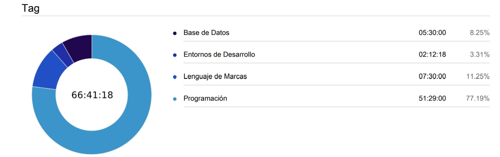
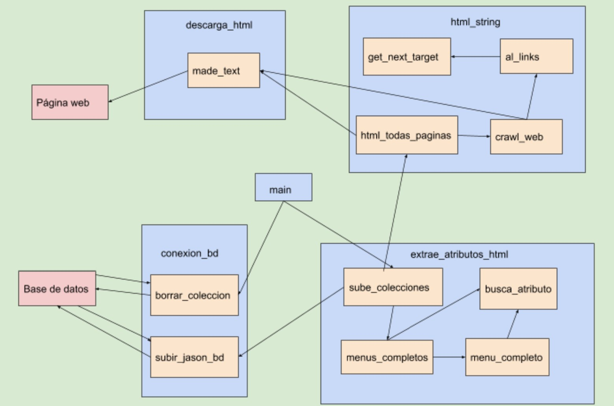
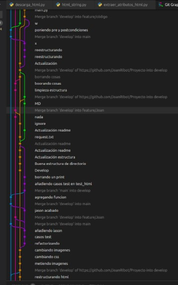

# Proyecto
Repositorio para el proyecto conjunto entre primero y segundo.

## ¿De qué va este proyecto?

Nosotros hemos enfocado este proyecto como que Rick viaja por los distintos planetas probando comida y decide que el planeta Tierra tiene los mejores platos del universo, entonces hemos hecho un sitio web sobre los menús más deliciosos de distintos países.

Este proyecto hará de intermediario entre dos proyectos. Consiste en que los alumnos de primer curso tienen que hacer un repositorio donde pondrán un documento .json con el schema proporcionado por su mentor de segundo curso.

## ¿Objetivo del proyecto?

El objetivo de este proyecto es conseguir scrapear un sitio web con distinta información sobre los menús de cada país que Rick tiene a su disposición para poderlo guardar en una base de datos.

## Instalación del proyecto

Primero de todo, tenemos que crear un directorio donde se va a encontrar el repositorio clonado

Después, tenemos que obtener el url del repositorio y en consola hacer un:
git clone “url del repo”

Para poder instalar las librerías necesarias, tendremos que tener Pip instalado.
En el caso de Windows, con la instalación de Python ya vendrá instalado y en el caso de Linux y Mac, se tendrá que hacer una instalación manual.

Una vez, tenemos pip, podemos pasar a la instalación de las librerías mediante:
pip install -r requirements.txt
Este documento contiene las librerías con las versiones específicas usadas para el proyecto.

Y una vez realizado todo lo anterior, podemos ejecutar el programa main.py para extraer y guardar la información en la base de datos.

## ¿Cómo hemos hecho el proyecto?

Este proyecto los hemos realizado Joan Ribot y Carlos Franco y para poder conseguir el objetivo empezamos primero de todo con el sitio web, con un index.html y dentro de este seis enlaces que llevan a los menús dividido en países. Estos enlaces tienen un número de 4 menús por país y cada menú se compone del nombre del menú, primer plato, segundo plato, postre, bebida, stock, precio y valoración de los clientes.
Una vez acabado esto, empezamos a construir el código para crawlear las páginas y posteriormente scrapearlas.
Para crawlear hemos tenido que convertir primero de todo los html a strings mediante una librería, una vez convertido a string buscamos los enlaces y los guardamos en un array.
Con ese array hemos entrado en cada uno de los enlaces para poder obtener la información que queremos.
Una vez estamos dentro de esos enlaces, buscamos la información mediante las clases, anteriormente puestas, en las etiquetas delante de la información que queremos conseguir.
Esa información la guardamos en diccionarios que finalmente son insertados en la base de datos, para una futura gestión de esos datos.

## ¿Qué librerías hemos usado?

Hemos usado dos librerías para poder conseguir el objetivo, una de ellas es requests_html. Esta librería nos permite descargar el html de la página y convertirlo en string para poder buscar en el la información necesaria.
Y también hemos tenido que usar pymongo, que es quien hace la conexión y se encarga de  insertar los diccionarios a la base de datos MongoDB.

## ¿Qué metodología hemos usado?

Nosotros pensamos que hemos usado un modelo en V, ya que este modelo nos permite la interacción entre el desarrollo y la validación, entonces como hemos ido haciendo debugging y tdd, cuando teníamos un fallo hemos podido volver atrás para solucionarlo y que pudiera pasar esos casos test.
Esto ha hecho que sepamos en todo momento el fallo que teníamos cuando apliabamos código.

Este modelo es ideal para proyectos pequeños y para un grupo entre una y cinco personas.

## ¿Cuánto tiempo hemos estado realizando el proyecto?

Primero de todo, tenemos que decir que no tenemos todas las horas contabilizadas, porque nos enteramos tarde que teníamos que usar clockify, entonces al enterarnos lo empezamos a usar.

Hemos hecho un total de 66 horas de proyecto, donde la mayoría de las horas ha sido haciendo el programa.
La parte de la creación del sitio web, no estuvimos mucho tiempo, porque nuestro objetivo era sacar el código antes de tener un sitio web bonito (y al final no hemos tenido tiempo de hacer), le dimos mucha preferencia al código.
Estuvimos varias horas para entender cómo funcionaba GitFlow y todo el tema de las ramas.
El programa, como es lógico, es lo que más tiempo nos ha llevado ya que tampoco somos unos cracks programando, pero gracias a informarse, ver la documentación del panel y demás lo hemos conseguido sacar.

Quitando las horas que no tenemos contabilizadas, que sobretodo fueron de lenguaje de marcas, este ha sido el total de horas utilizadas en el proyecto

## Diagrama de componentes

## Git Flow

Tenemos una rama llamada main que simplemente se usaba cuando conseguiamos hacer cosas que funcionaran correctamente, después teníamos una rama de desarrollo donde íbamos subiendo todos los cambios que realizabamos y después cada uno de nosotros tenía una rama, donde trabajabamos individualmente.

No se ve muy nítida la foto, pero es una pequeña demostración del trabajo realizado.

## Posibles mejoras

Mejoras como es lógico puede haber muchísimas, cómo refactorizar código, mejorar el sitio web…

Pero bajo el desconocimiento y el tiempo, tampoco hemos podido llegar a hacer mucho más, pero nos gustaría poder mejorar el proyecto para que tuviera más nivel y fuera más bonito tanto para los programadores que lo leyeran como para cualquier persona que lo tuviera que usar.

## Principales dificultades

A lo largo del proyecto hemos tenido varias dificultades, como no saber si se podían importar librerías e intentar hacer las cosas sin librerías, no saber usar correctamente el gitflow y tener errores con el entorno virtual porque uno tiene linux y otro microsoft.

Y la dificultad que más tiempo nos ha llevado ha sido que cuando importamos una función de un módulo a otro. Cuando queríamos pasar los casos test, teníamos que poner en la ruta un . y cuando queríamos ejecutar el programa teníamos que quitarlo.
Eso finalmente lo solucionamos llamando a las funciones en una general que ejecutara todo el código y de esta manera poder pasar los casos test y ejecutar el programa sin tener que hacer cambios.

## Experiencia sobre el proyecto - Carlos

A mi este proyecto me ha gustado mucho porque he podido aprender muchísimas cosas, por ejemplo, ni sabía que existía el Scrapping y de no saber que era, he hecho un programa scrapeando una sitio web. 
He aprendido mucho sobre programación en este proyecto, me he buscado la vida en casi todas las ocasiones buscando información o el funcionamiento de alguna cosa. Me ha gustado hacerlo en pareja porque algunas cosas que yo no sabía, la otra persona a lo mejor me podía ayudar y también tengo que dar las gracias a los demás, que siempre que se les ha pedido alguna duda, han intentado ayudar.
Este proyecto puede que esté mejor o peor, pero yo me siento bastante satisfecho de haber conseguido el objetivo, de haber aprendido y saber que me falta por aprender mucho más.

## Experiencia sobre el proyecto - Joan

Este proyecto me ha parecido interesante, también he aprendido mucho sobre programación en este proyecto, me he vuelto loco con el debugging buscando errores, y eso también me ha ayudado a entender mejor como funciona y a encontrar errores más rápido.
Sobre hacerlo en equipo, pienso como Carlos, a la hora de resolver problemas es muy útil tener a otra persona que pueda resolverlos o explicartelos, y después estaban los compañeros, que siempre que te podían resolver algo, lo hacían.
Aunque como dice carlos, este proyecto pueda estar peor o mejor, al final, aunque no sea algo perfecto, hemos aprendido mucho de él, y nos hemos podido dar cuenta de las carencias que tenemos y que tendré en cuenta de cara a futuros proyectos que pueda realizar.

